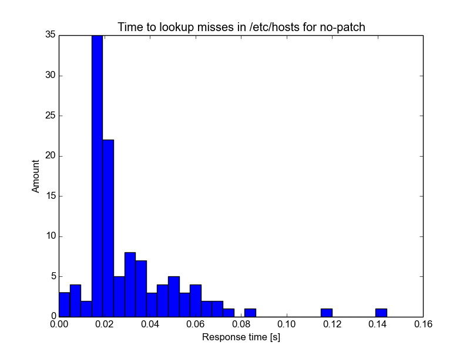
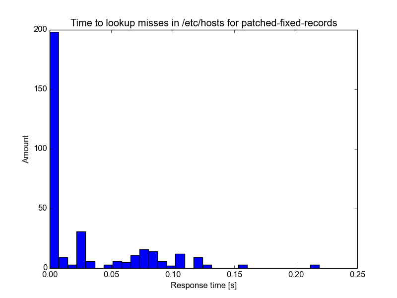
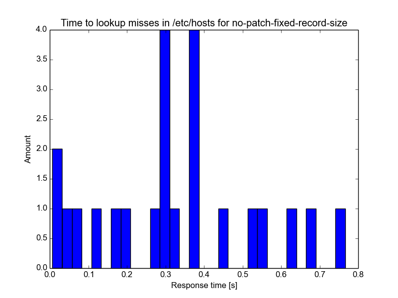
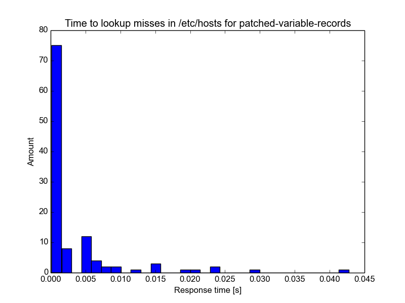

# Proposal to speed up /etc/hosts lookup

**The changes proposed here were included in Cyanogenmod [on Aug 4, 2016](http://review.cyanogenmod.org/#/c/150364/).**

## Synopsis
Android's `/etc/hosts` files can become quite large on some systems,
with a number in the order of 10,000s of entries. Android's libc does a linear
lookup in this file for each DNS query. Here, it is proposed to sort the hosts
file and patch libc to do a binary search (hence, O(log(n)) lookup) instead.

## Proposal
* Patch Bionic/libc to maintain a sorted cache of the entries in `/etc/hosts`.
  Prefer lookups in that cache if it exists and is up to date. Elsewise,
  perform lookups as before.

  The patch is in the `cached_variant` subdirectory.

## Testing / Validation
The patch has been tested on a live cm-12.1 system and using the code from the `cached_variant`
directory on a large hosts file with

* overly long lines
* lots of comments/empty lines
* queries against domains that lie in between each two other domains (in the
  sort order)

Also, in the same directory, there is a python script to lookup all entries of
a hosts file (that must be extracted from an android device before).

## Rationale
It is obvious why replacing the O(n) lookup with a O(log(n)) one is beneficial
for large data sets, especially if that upper bound is often reached by lookups
for non-iternal, or non-blocked, hosts. What is not is if the speed impact
justifies the expense of having an additional patch to maintain.

The first approach to this defined a file format for sorted hosts lists and
made users responsible for creating a file in said format. The measurements
below were taken using this implementation. It was later found that it is far
more practical to create this sorted version of the file on the fly and cache
it. The time measurements are still accurate.

The patch
[time-measurement-logcat.patch](patches/time-measurement-logcat.patch) has been
used to measure the time spent with failed lookups in `/etc/hosts` on a
Cyanogenmod device with Google apps installed, about 15 apps that autostart,
from boot until about 10 minutes uptime, with some random webbrowsing. This
should be sufficient to average over load-related timing issues. Four
measurements were taken that answer both of the above questions.

### No patch, normal hosts file
It takes about 20ms on average to find that a domain is not contained in the file.

### Patched system with binary search, hosts file with fixed record size
Here, instead of having variable-sized line lengths, a binary format for the hosts
file was made up that is designed to be compatible with unpatched systems. After
the line with the header, all entries have the format

     <-- total entry length: 256 bytes  ------------------------------------------->
     -------------------------------------------------------------------------------
    | IP in ascii notation, 38 bytes, padded with chr(32) | Hostname 217 bytes | \n |
     -------------------------------------------------------------------------------

Libc was [patched to do a binary lookup in this
file](patches/fixed-record-size-lookup.patch). Failed lookups now take slightly
less than 1ms on average:

### Unpatched system, hosts file with fixed record size
This test is in place to see the impact of having a much larger hosts file in the
format described in the previous section on an unpatched system. The average goes
up to 300ms.

### Patched system with binary search, normal hosts file
This final version is the one that is proposed above: The hosts file is left untouched, but
still a binary search is performed. The pivot does not align with the start of a record
anymore, so after choosing the pivot, the file is skipped until the next `\n`.
Its lookup times are as fast as for the fixed record size version, and its
hosts files have zero impact on unpatched systems, because they stay unaltered.

